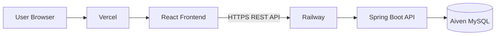

# 💻 Contact Manager — Enterprise React Frontend

### Modern, Secure, Scalable & Production-Ready React Application

 

A production-ready frontend application built using **React 18**, **Bootstrap 5**, **Axios**, **React Router DOM**, and **JWT Authentication**.

The application follows modern frontend engineering principles including reusable components, protected routing, centralized API communication, responsive UI, cloud deployment, and enterprise-level architecture.

Designed to work seamlessly with the **Spring Boot Contact Manager REST API**.

 

### 🌐 Live Production

| Service | Platform | Status |
|----------|----------|--------|
| Frontend | Vercel | 🟢 Live |
| Backend | Railway | 🟢 Live |
| Database | Aiven MySQL | 🟢 Live |

### 🚀 Live URLs

**Frontend**

https://contact-manager-ui-alpha.vercel.app/contacts

**Backend API**

https://contact-manager-api-production-0aa6.up.railway.app

**Frontend Repository**

https://github.com/AkramSE/Contact-Manager-UI

**Backend Repository**

https://github.com/AkramSE/Contact-Manager-API

---

# 📑 Table of Contents

- Overview
- Live Deployment
- Cloud Infrastructure
- Features
- Technology Stack
- Frontend Architecture
- Authentication Flow
- API Communication
- Folder Structure
- Routing
- State Management
- Axios Configuration
- Environment Variables
- Local Development
- Production Deployment
- Performance Optimizations
- Security
- Responsive Design
- Build Process
- Future Roadmap
- Contributing
- License
- Author

---

# 📌 Overview

Contact Manager Enterprise Frontend is a secure React application developed following enterprise software architecture.

The application communicates with a Spring Boot backend using REST APIs secured with JWT Authentication.

It provides an intuitive user interface for authenticated users to manage contacts efficiently while maintaining scalability, maintainability, and security.

---

# 🚀 Live Deployment

| Platform | Purpose |
|-----------|----------|
| **Vercel** | Frontend Hosting |
| **Railway** | Spring Boot Backend |
| **Aiven Cloud** | Production MySQL Database |
| **GitHub** | Version Control |
| **JWT** | Authentication |
| **HTTPS** | Secure Communication |

---

# ☁️ Cloud Infrastructure

---

# ✨ Enterprise Features

## 🔐 Authentication

- JWT Authentication
- Secure Login
- Secure Registration
- Protected Routes
- Auto Login
- Auto Logout
- Token Validation
- Secure Local Storage

---

## 📇 Contact Management

- Create Contact
- Update Contact
- Delete Contact
- Search Contact
- Pagination
- CSV Export
- CSV Import
- User Dashboard

---

## 🎨 User Experience

- Bootstrap 5
- Glassmorphism UI
- Responsive Design
- SweetAlert2
- Loading Spinners
- Error Pages
- Empty States
- Mobile Friendly

---

## ⚡ Engineering Features

- Axios Interceptors
- Protected Routing
- Component Reusability
- API Service Layer
- Environment Configuration
- React Hooks
- Context API
- Optimized Rendering
- Modular Folder Structure
- Production Build Ready
